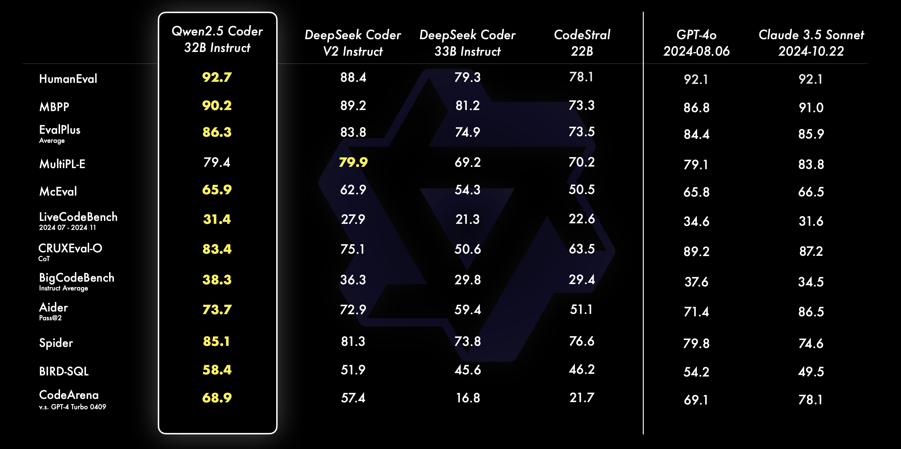

# Your own SOTA code inference server with Qwen2.5-Coder-32B on Vast.ai

## Introduction

Open source models like Qwen2.5-Coder are now matching and sometimes surpassing commercial models like GPT-4o, enabling powerful local AI development with full privacy and control.

The best coding open source model to date is the Qwen2.5-Coder-32B which is a 32B parameters model with a context length of up to 130k tokens developed by Alibaba's Qwen Research team. The model has shown some impressive benchmark performance often seating between GPT-4o and Claude 3.5 sonnet:



If you are like most (me included) your hardware do not allow to run a model of that size at a decent speed.

Thanks to quantization the requirement to run such a model are drastically reduced and as it turns out it can even run on a single consumer grade GPU (RTX 4090) if we limit the context length to 15k tokens.

Buying a GPU of that size is still an expensive investment however thanks to vast.ai we can easily rent a (RTX 4090) GPU for only 0.3 $/hour.

In this technical article, I will show you how to combine the power of Qwen2.5-Coder 32B, the efficient compression of quantization, the inference speed of llama.cpp server and the cheap price of vast.ai to run your very own fully private SOTA code inference server at only 0.3 $/hour. You will be able to generate code at 40 tokens per second surpassing typical reading speeds. We will finish by integrating the inference server into pearAI a Cursor open source alternative based on continue.dev.

## Prerequisites

To follow along you need a vast.ai account that can be created for free here:
https://cloud.vast.ai/create/

Then you need to topup your account with a few dollars to cover the costs of the GPUs (0.3 $/hour).:
https://cloud.vast.ai/billing/

If you want to leverage the CLI script that comes with this article you also need vastAI CLI tool:
https://cloud.vast.ai/cli/

## Deploying Qwen2.5-Coder-32B

We will deploy a 4 bit quantized version of the model provided by Daniel Han (@unsloth.ai) in GGUF format on hugging face: https://huggingface.co/unsloth/Qwen2.5-Coder-32B-Instruct-128K-GGUF/blob/main/Qwen2.5-Coder-32B-Instruct-Q4_K_M.gguf. The GGUF format https://huggingface.co/docs/hub/gguf is a popular self contained binary format that contains all the necessary information to run the model (both metadata and weigths). It was created by @ggerganov the author of lamma.cpp from which we will also borrow the inference server code to deploy.

I provided 2 options to deploy the inference server: semi-automated via a script that will look at compatible instances on vast.ai, let you select among the best 3 options and then deploy the server for you. The other option consist in create a template in vast.ai UI and searching an instance manually. 

### option 1: one-script deployment (recommended)

The fastest way to get your code inference up and running is through the `vastai_search.py` script.

The script leverage the vast.ai CLI tool to search for compatible instances and then deploy the Qwen2.5-Coder-32B model on the selected instance.

To run the script:

```bash
wget https://raw.githubusercontent.com/grll/articles/main/20241124_qwen2.5_coder_32b/vastai_search.py
python vastai_search.py
```

or

```bash
wget https://raw.githubusercontent.com/grll/articles/main/20241124_qwen2.5_coder_32b/vastai_search.py
chmod +x vastai_search.py
./vastai_search.py
```

The script will interactively prompt for instance selection after displaying options.

when an instance is selected, the script will create a new instance on vast.ai and deploy the Qwen2.5-Coder-32B model on it.

You will get the URL of the inference server as soon as available by the script however note that it takes roughly 10 minutes to download the model on the instance.

Navigate to the url provided to start using the inference server and model.

### option 2: manual deployment in vast.ai UI

#### Template Creation

vast.ai relies on docker to isolate the renter's environment from the host's host environement. It additionally provides a template feature to help create docker images and store some parameters to deploy on vast.ai instances. Before renting an instance you must select a template containing the docker image and a few other settings defining how the instance will be created (for example storage requirements...). 

Navigate to the template page in the vast.ai UI:

https://cloud.vast.ai/templates/

you can either use my public vast.ai template:

https://cloud.vast.ai/?ref_id=137438&template_id=6e39ce6b12abc8fcbf1f76350c99fc7c

or create your own template (by clicking the + create new template button) and filling the following:

[screenshot]

Note that we directly use the image from ggerganov/llama.cpp:server-cuda-b4154 which is a docker image containing everything to run llama.cpp server with CUDA GPU support. This particular image requires CUDA 12.6, also as the model in 4bit is roughly 20GB it is recommended to have at least 20GB of RAM and a GPU above 20GB of VRAM as well, RTX 4090 is a good choice.

#### Instance Creation

Once the template has been created you can jump on the search page of vast.ai. Where you can see all the offers from various GPU owners.

Make sure to select the right template you just created with allocated disk space of minimum 30GB. 

Also make sure to have the following criterion when selecting an instance:
- min 20GB of CPU RAM
- filter for gpu name RTX 4090 (recommended)
- filter for countries as you wish (recommended to have a region close to you)
- minimum version of cuda 12.6

It's recommended to sort results by "price inc." once your filters are set.

You can review the details of the price by hovering over the "rent" button. Expect at least 20GB of download for the weights of the model.

Once your happy with an instance, click on the "rent" button and navigate to the instances page: https://cloud.vast.ai/instances/
where your instance should show up.

## Monitoring your Qwen2.5-Coder-32B inference server

Regardless of how you created the instance you will be able to monitor it in https://cloud.vast.ai/instances/.

To monitor you can directly ssh within the instance with the "connect" button. You can also see RAM, GPU, CPU, disk usage from that page. You can also see the logs from the instance with the "logs" button. By clicking on the blue ip address button you will also see the public IP and the port mapping to 8081. This is the adress to connect to access your inference server.

## Using your Qwen2.5-Coder-32b inference server

### Using the web interface

Llama.cpp server provides a web interface to interact with the model. You can access it at http://<public_ip>:<port_mapping>/ where <public_ip> is the public IP of your instance and <port_mapping> is the port mapping to 8081 that you can find in the instance page https://cloud.vast.ai/instances/.

### Integrating it into your IDE for a Cursor like experience

While Cursor do not allow at this time to bring your own LLM inference server. Cursor alternatives like continue.dev or PearAI allows it. To setup continue.dev or PearAI navigate to your config.json file for pearAI this is usually located at `~/.pearai/config.json` and add the following:

```json
    {
      "title": "Qwen2.5-Coder-32B (llama.cpp Q4_K_M on vast.ai)",
      "provider": "llama.cpp",
      "model": "Qwen2.5-Coder-32B",
      "apiBase": "http://<public_ip>:<port_mapping>"
    }
```

You will then be able to use it in `ctrl+l` interaction or in inline editing like `ctrl+i`.

## Conclusion

In this short technical article you learned how to deploy your own Qwen2.5-Coder-32B inference server on vast.ai rivalising in coding performances with openAI gpt-4o on a single GPU for only 0.3 $/hour. This is a huge step forward for OSS LLMs and will enable for sure many use cases and efficiency gain.


thanks and references:
* Qwen2 team for releasing Qwen2.5-Coder-32B open source see technical report https://arxiv.org/html/2409.12186v3
* llama.cpp for providing a simple way to create an inference server.
* Daniel Han at unsloth ai for quantizing the model and making it available on HF
* vast.ai for providing a simple and easy to use API for GPU instances as well as extremly competitive prices 
* pearAI / continue.dev for an open source alternative to Cursor